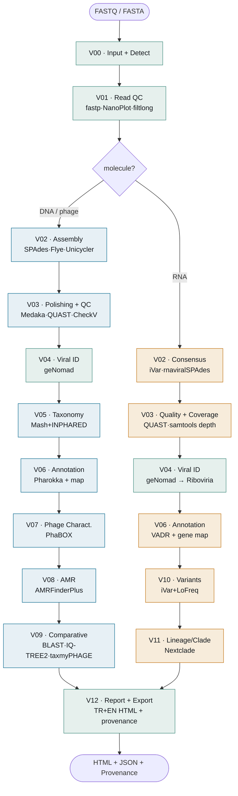

<div align="center">

# 🧬 VirusForge

**A modular, end-to-end analysis platform for whole-genome bioinformatics of RNA & DNA viruses and bacteriophages**

[](https://www.python.org/)
[](LICENSE)
[](tests/)
[](docs/)
[](#)

[Türkçe](README.md) · **English**

</div>

---

VirusForge **auto-detects** short-read, long-read, hybrid and pre-assembled inputs and processes them from quality control to the final report with a single command. When a **bacteriophage / DNA virus** is detected, phage-specific modules (Pharokka, PhaBOX, AMR, comparative/phylogeny) engage; for **RNA viruses**, the reference-based consensus + VADR annotation + variant/quasispecies + lineage/clade (Nextclade) path **runs and has been validated on SARS-CoV-2** (M2-B complete).

A sibling of BacForge (bacteria) and Vaxforge, this platform follows the same architectural pattern but is a **fully isolated** installation.

## ✨ Highlights

- **Automatic routing** — detects read type (short/long/hybrid/assembly) and genome type (DNA/RNA) with no user prompts
- **Honest output** — no fake/hard-coded results, no invented DOIs, tool mismatches are never hidden; statuses are `PASS · WARNING · FAIL · NOT_APPLICABLE · SKIPPED`
- **Traceable & reproducible** — every result is recorded in `provenance.json` with tool + database versions and parameters
- **Professional report** — numbered tables/figures, **circular genome map**, functional-distribution charts, tool+DOI references (self-contained HTML)
- **Verified tool registry** — every tool's official repository was checked individually (6 wrong/dead repos fixed)

## 🔬 Pipeline

One pipeline, two paths: `V00`–`V01` are shared; after the molecule decision (`--molecule` / geNomad Riboviria)
the DNA/phage and RNA virus branches split and rejoin at the `V12` report. Read type (short/long/hybrid/assembly)
is a separate, orthogonal axis. Interactive bilingual diagram: [`docs/pipeline_architecture.html`](docs/pipeline_architecture.html).



## 🧩 Modules

Every module branches internally on molecule type; a module that does not fit that path honestly returns **N/A**.

| Code | Module | DNA / phage path | RNA virus path |
|:---:|---|---|---|
| **V00** | Input & Detect | ↔ **shared** — read type + molecule (geNomad Riboviria / `--molecule`) | ↔ |
| **V01** | Read QC | ↔ **shared** — fastp · FastQC · NanoPlot · filtlong · MultiQC | ↔ |
| **V02** | Assembly / Consensus | SPAdes · Flye · Unicycler *(de novo)* | iVar consensus (ref) · rnaviralSPAdes |
| **V03** | Polishing & Quality | Medaka · QUAST · CheckV | QUAST · coverage (samtools depth) |
| **V04** | Viral Identification | ↔ **shared** — geNomad (viral confirmation + taxonomy) | ↔ |
| **V05** | Taxonomy & References | Mash + INPHARED · NJ tree | *N/A — phage-specific* |
| **V06** | Genome Annotation | Pharokka + circular genome map | VADR + gene map |
| **V07** | Phage Characterization | PhaBOX (PhaMer/PhaGCN/PhaTYP) | *N/A* |
| **V08** | AMR & Virulence | AMRFinderPlus | *N/A* |
| **V09** | Comparative & Phylogeny | BLAST · MAFFT · IQ-TREE2 · taxmyPHAGE · VIRIDIC · synteny | *N/A* |
| **V10** | Variants & Quasispecies | *N/A — RNA-specific* | iVar variants + LoFreq (type/effect/gene) |
| **V11** | Lineage / Clade | *N/A — RNA-specific* | Nextclade (clade + PANGO lineage + QC) |
| **V12** | Report & Export | ↔ **shared** — bilingual (TR+EN) HTML report + provenance | ↔ |

## 🚀 Installation

```bash
git clone https://github.com/aliarslan47/VirusForge.git
cd VirusForge

# Isolated conda environment
conda env create -f environment.yml
conda activate virusforge
pip install -e .

# Databases (CheckV, geNomad, Pharokka, INPHARED, PhaBOX)
bash setup/get_databases.sh
```

## 💻 Usage

```bash
# Show installed tool versions
python -m virusforge.cli info

# Place a sample: samples/<id>/  (short: *_R1/_R2, long: single ONT fastq, assembly: *.fasta)
python -m virusforge.cli run --sample samples/T7_short --out runs --threads 8

# → runs/<timestamp>_<mode>/report.html  (self-contained professional report)
```

## 📊 Example result — *Escherichia phage* T7 (short-read, validated)

Real ENA data (`ERR3804828`, Illumina MiSeq): **all modules on the DNA/phage path PASS** (V10/V11 RNA modules are N/A for this sample):

| Analysis | Result |
|---|---|
| Genome quality (CheckV) | **100% complete · 0% contamination · Complete** |
| Assembly (QUAST) | 45,451 bp · largest contig 40,659 bp · N50 40,659 |
| Viral ID (geNomad) | Caudoviricetes; **Autographiviridae** (score 0.98) |
| Closest reference (Mash) | `V01146` (T7 reference) · distance 0.0036 |
| Annotation (Pharokka) | **76 CDS** · head&packaging 14 · DNA/RNA metab. 16 |
| Lifestyle (PhaBOX) | **virulent** · subfamily **Studiervirinae** |

📄 **Example report:** [view live](https://claude.ai/code/artifact/0541885b-ce14-4011-87db-6eecc212b819)

## 🧪 Verified tool registry (core)

| Tool | Role | DOI |
|---|---|---|
| [fastp](https://github.com/OpenGene/fastp) | Read preprocessing | 10.1093/bioinformatics/bty560 |
| [SPAdes](https://github.com/ablab/spades) | Assembly | 10.1089/cmb.2012.0021 |
| [CheckV](https://bitbucket.org/berkeleylab/checkv) | Viral completeness/contamination | 10.1038/s41587-020-00774-7 |
| [geNomad](https://github.com/apcamargo/genomad) | Viral ID & taxonomy | 10.1038/s41587-023-01953-y |
| [Mash](https://github.com/marbl/Mash) + [INPHARED](https://github.com/RyanCook94/inphared) | Closest reference | 10.1186/s13059-016-0997-x |
| [Pharokka](https://github.com/gbouras13/pharokka) | Phage annotation | 10.1093/bioinformatics/btac776 |
| [PhaBOX](https://github.com/KennthShang/PhaBOX) | Phage characterization | 10.1093/bioadv/vbad101 |

> Full registry: [`docs/2026-08-12-virusforge-design.md`](docs/2026-08-12-virusforge-design.md) · Versions are detected at runtime, DOIs are the publication source — **nothing fabricated**.

## 🗺️ Roadmap

- [x] **M1** — DNA/phage core · **short + long + hybrid + assembly validated on real T7 data** (full platform coverage)
- [x] **M2-A** — phage enrichment: **V08 AMR & virulence (AMRFinderPlus)** · validated on T7
- [x] **M3** — **V09 comparative & phylogeny** (BLAST + IQ-TREE2 + taxmyPHAGE ICTV + VIRIDIC + synteny) · multi-sample `compare` + clinker · validated on T7
- [x] **M2-B** — **RNA virus path** (iVar consensus · VADR · V10 iVar/LoFreq variants · V11 Nextclade lineage/clade) · **validated on real SARS-CoV-2 data** (XBB.1.5.52)
- [ ] Next (optional): RNA de novo (reference-free) validation · metavirome · detection tools (virsorter2/vibrant/kraken2) · RNA lineage add-ons (IRMA)

## 📁 Structure

```
virusforge/        Python package (modules/ · tools · pipeline · report · registry)
config/            default + user YAML
databases/         downloaded DBs           (git-ignored)
runs/              timestamped runs         (git-ignored)
samples/           input samples            (git-ignored)
docs/              design docs + plans
setup/             DB download scripts
```

## 🧭 Principles

**Isolation** — VirusForge follows BacForge's architectural pattern but is a separate package/env/installation; no cross-imports.
**Honesty** — WARNING when there is no value, NOT_APPLICABLE when it does not apply; never a fabricated/hard-coded result.
**Traceability** — input SHA → tool+version → DB+version → command → output SHA chain.

---

<div align="center">
<sub>Forge family · BacForge (bacteria) · Vaxforge · <b>VirusForge</b> (virus/phage)</sub>
</div>

*License: [MIT](LICENSE)*
