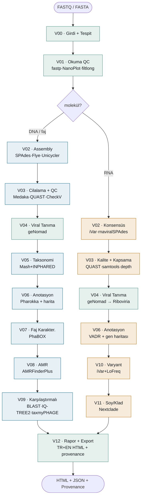

# VirusForge

RNA ve DNA virüsleri ile bakteriyofajların tam genom analizi için modüler, uçtan uca bir pipeline.

[](https://aliarslan47.github.io/VirusForge/pipeline_architecture.html)
[](https://aliarslan47.github.io/VirusForge/pipeline_architecture.html)
[](https://aliarslan47.github.io/VirusForge/pipeline_architecture.html)

Türkçe · [English](README.en.md)

---

Short-read, long-read, hybrid ve hazır-assembly girdilerini otomatik tanır ve kalite kontrolünden nihai
rapora kadar tek komutla işler. Molekül tipine göre iki yola ayrılır: bakteriyofaj ve DNA virüsleri için
Pharokka, PhaBOX, AMR ve karşılaştırmalı/filogenetik modüller; RNA virüsleri için referans-tabanlı konsensüs,
VADR anotasyonu, varyant/quasispecies çağırma ve Nextclade ile soy/klad tayini. RNA yolu SARS-CoV-2 verisiyle
doğrulanmıştır.

VirusForge, BacForge (bakteri) ve Vaxforge ile aynı mimari deseni izler; ayrı ve izole bir kurulumdur.

## Pipeline

`V00`–`V01` her iki yol için ortaktır. Molekül kararından sonra (`--molecule` seçeneği veya geNomad'ın
Riboviria tespiti) DNA/faj ve RNA dalları ayrılır ve `V12` raporunda birleşir. Okuma tipi
(short/long/hybrid/assembly) buna dik, ayrı bir eksendir. Etkileşimli çift-dilli şema:
[**render edilmiş şema**](https://aliarslan47.github.io/VirusForge/pipeline_architecture.html) · kaynak: `docs/pipeline_architecture.html`.



## Modüller

Her modül molekül tipine göre dallanır; o yola uymayan modül `NOT_APPLICABLE` döner.

| Kod | Modül | DNA / faj yolu | RNA virüs yolu |
|:---:|---|---|---|
| V00 | Girdi & Tespit | ortak: okuma tipi + molekül (geNomad Riboviria / `--molecule`) | ortak |
| V01 | Okuma QC | ortak: fastp · FastQC · NanoPlot · filtlong · MultiQC | ortak |
| V02 | Assembly / Konsensüs | SPAdes · Flye · Unicycler (de novo) | iVar konsensüs (ref) · rnaviralSPAdes |
| V03 | Cilalama & Kalite | Medaka · QUAST · CheckV | QUAST · kapsama (samtools depth) |
| V04 | Viral Tanıma | ortak: geNomad (viral doğrulama + taksonomi) | ortak |
| V05 | Taksonomi & Referans | Mash + INPHARED · NJ ağaç | N/A (faj-özel) |
| V06 | Genom Anotasyon | Pharokka + circular genom haritası | VADR + gen haritası |
| V07 | Faj Karakterizasyonu | PhaBOX (PhaMer/PhaGCN/PhaTYP) | N/A |
| V08 | AMR & Virülans | AMRFinderPlus | N/A |
| V09 | Karşılaştırmalı & Filogeni | BLAST · MAFFT · IQ-TREE2 · taxmyPHAGE · VIRIDIC · synteny | N/A |
| V10 | Varyant & Quasispecies | N/A (RNA'ya özel) | iVar variants + LoFreq (tür/etki/gen) |
| V11 | Soy / Klad Tayini | N/A (RNA'ya özel) | Nextclade (klad + PANGO soyu + QC) |
| V12 | Rapor & Export | ortak: çift-dilli (TR+EN) HTML rapor + provenance | ortak |

## Kurulum

```bash
git clone https://github.com/aliarslan47/VirusForge.git
cd VirusForge

conda env create -f environment.yml
conda activate virusforge
pip install -e .

# Veritabanları (CheckV, geNomad, Pharokka, INPHARED, PhaBOX)
bash setup/get_databases.sh
```

## Kullanım

```bash
# Kurulu araç sürümleri
python -m virusforge.cli info

# Örnek: samples/<id>/  (short: *_R1/_R2, long: tek ONT fastq, assembly: *.fasta)
python -m virusforge.cli run --sample samples/T7_short --out runs --threads 8

# Çıktı: runs/<zaman>_<mod>/report.html
```

## Örnek: *Escherichia phage* T7 (short-read)

Gerçek ENA verisi (`ERR3804828`, Illumina MiSeq). DNA/faj yolundaki tüm modüller PASS; V10/V11 (RNA)
bu örnekte N/A.

| Analiz | Sonuç |
|---|---|
| Genom kalitesi (CheckV) | %100 tam · %0 kontaminasyon · Complete |
| Assembly (QUAST) | 45.451 bp · en büyük contig 40.659 bp · N50 40.659 |
| Viral tanıma (geNomad) | Caudoviricetes; Autographiviridae (skor 0.98) |
| En yakın referans (Mash) | `V01146` (T7 referansı) · mesafe 0.0036 |
| Anotasyon (Pharokka) | 76 CDS |
| Yaşam tarzı (PhaBOX) | virulent · alt-familya Studiervirinae |

## Araç kaydı

Her aracın resmî deposu ve yayını doğrulandı; sürümler çalışma anında tespit edilir, DOI'ler yayın
kaynağıdır. Tam liste: [`docs/2026-08-12-virusforge-design.md`](docs/2026-08-12-virusforge-design.md).

| Araç | Rol | DOI |
|---|---|---|
| [fastp](https://github.com/OpenGene/fastp) | Okuma ön-işleme | 10.1093/bioinformatics/bty560 |
| [SPAdes](https://github.com/ablab/spades) | Assembly | 10.1089/cmb.2012.0021 |
| [CheckV](https://bitbucket.org/berkeleylab/checkv) | Viral tamlık/kontaminasyon | 10.1038/s41587-020-00774-7 |
| [geNomad](https://github.com/apcamargo/genomad) | Viral tanıma & taksonomi | 10.1038/s41587-023-01953-y |
| [Mash](https://github.com/marbl/Mash) + [INPHARED](https://github.com/RyanCook94/inphared) | En yakın referans | 10.1186/s13059-016-0997-x |
| [Pharokka](https://github.com/gbouras13/pharokka) | Faj anotasyonu | 10.1093/bioinformatics/btac776 |
| [PhaBOX](https://github.com/KennthShang/PhaBOX) | Faj karakterizasyonu | 10.1093/bioadv/vbad101 |
| [VADR](https://github.com/ncbi/vadr) | RNA virüs anotasyonu | 10.1186/s12859-020-3537-3 |
| [Nextclade](https://github.com/nextstrain/nextclade) | Klad + soy tayini | 10.21105/joss.03773 |

## Yol haritası

- [x] M1 — DNA/faj çekirdek; short, long, hybrid ve assembly girdileri T7 verisiyle doğrulandı
- [x] M2-A — faj zenginleştirme: V08 AMR & virülans (AMRFinderPlus)
- [x] M3 — V09 karşılaştırmalı & filogeni; çoklu-örnek `compare` ve clinker
- [x] M2-B — RNA virüs yolu (iVar konsensüs, VADR, V10 varyant, V11 Nextclade); SARS-CoV-2 ile doğrulandı
- [ ] Opsiyonel: RNA de novo doğrulama · metavirome · ek tespit araçları (virsorter2/vibrant/kraken2)

## Depo yapısı

```
virusforge/   Python paketi (modules · tools · pipeline · report · registry)
config/       varsayılan ve kullanıcı YAML
databases/    indirilen veritabanları  (git dışı)
runs/         zaman-damgalı koşular     (git dışı)
samples/      girdi örnekleri           (git dışı)
docs/         tasarım dokümanları ve planlar
setup/        veritabanı indirme scriptleri
```

## İlkeler

- İzolasyon: ayrı paket, ayrı ortam, çapraz-import yok.
- Dürüstlük: değer yoksa `WARNING`, uygun değilse `NOT_APPLICABLE`; sabit veya uydurma sonuç yok.
- İzlenebilirlik: girdi SHA → araç + sürüm → veritabanı + sürüm → komut → çıktı SHA zinciri (`provenance.json`).

## Lisans

[MIT](LICENSE). Forge ailesi: BacForge (bakteri) · Vaxforge · VirusForge (virüs/faj).
