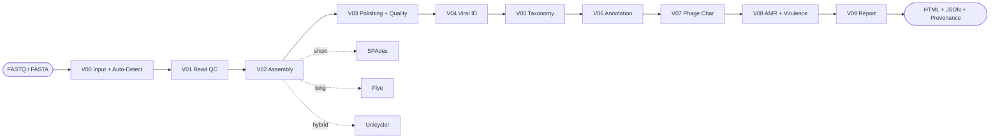

<div align="center">

# 🧬 VirusForge

**RNA & DNA virüslerinin ve bakteriyofajların tam genom biyoinformatiği için modüler, uçtan-uca analiz platformu**

[](https://www.python.org/)
[](LICENSE)
[](tests/)
[](docs/)
[](#)

</div>

---

VirusForge; short-read, long-read, hybrid ve hazır-assembly girdilerini **otomatik tanıyıp** kalite kontrolünden nihai rapora kadar tek komutla işler. Genel viral hat her uygun virüste çalışır; **bakteriyofaj tespit edilirse** phage-özel modüller (yaşam tarzı, AMR/virülans...) devreye girer. **RNA virüsleri** için reference-based/consensus + varyant/quasispecies yolu (M2-B) planlıdır.

BacForge (bakteri) ve Vaxforge'un kardeşi olan bu platform, aynı mimari deseni izler ama **tamamen izole** bir kurulumdur.

## ✨ Öne çıkanlar

- **Otomatik yönlendirme** — kullanıcıdan seçim istemeden read-tipi (short/long/hybrid/assembly) ve genom-tipi (DNA/RNA) tespiti
- **Dürüst çıktı** — sahte/sabit sonuç yok, uydurma DOI yok, araç uyuşmazlığı gizlenmez; durumlar `PASS · WARNING · FAIL · NOT_APPLICABLE · SKIPPED`
- **İzlenebilir & yeniden üretilebilir** — her sonuç tool + veritabanı sürümü ve parametreleriyle `provenance.json`'a kaydedilir
- **Profesyonel rapor** — numaralı tablolar/şekiller, **circular genom haritası**, fonksiyonel dağılım grafikleri, araç+DOI referansları (self-contained HTML)
- **Doğrulanmış araç kaydı** — her aracın resmî deposu tek tek kontrol edildi (6 hatalı/ölü repo düzeltildi)

## 🔬 Pipeline



## 🧩 Modüller

| Kod | Modül | Ana araç | Milestone |
|:---:|---|---|:---:|
| **V00** | Input & Otomatik Tespit | *(özel)* | ✅ M1 |
| **V01** | Okuma Kalitesi & Ön-İşleme | FastQC · fastp · NanoPlot | ✅ M1 |
| **V02** | Viral Genom Assembly | SPAdes / Flye / Unicycler | ✅ M1 |
| **V03** | Cilalama & Genom Kalitesi | QUAST · CheckV · Medaka | ✅ M1 |
| **V04** | Viral Dizi Tanıma | geNomad | ✅ M1 |
| **V05** | Taksonomi & En Yakın Referanslar | Mash + INPHARED | ✅ M1 |
| **V06** | Genom Annotation | Pharokka | ✅ M1 |
| **V07** | Faj-Özel Karakterizasyon | PhaBOX | ✅ M1 |
| **V08** | AMR & Virülans | AMRFinderPlus | ✅ M2-A |
| **V09** | Nihai Rapor & Export | *(özel)* | ✅ M1 |
| 🔜 | RNA-virüs yolu (M2-B) + karşılaştırmalı / filogeni (M3) | rnaviralSPAdes · VADR · iVar/LoFreq · VIRIDIC · IQ-TREE2 | 🔜 |

## 🚀 Kurulum

```bash
git clone https://github.com/aliarslan47/VirusForge.git
cd VirusForge

# İzole conda ortamı
conda env create -f environment.yml
conda activate virusforge
pip install -e .

# Veritabanları (CheckV, geNomad, Pharokka, INPHARED, PhaBOX)
bash setup/get_databases.sh
```

## 💻 Kullanım

```bash
# Kurulu araç sürümlerini gör
python -m virusforge.cli info

# Örneği koy: samples/<id>/  (short: *_R1/_R2, long: tek ONT fastq, assembly: *.fasta)
python -m virusforge.cli run --sample samples/T7_short --out runs --threads 8

# → runs/<zaman>_<mod>/report.html  (self-contained profesyonel rapor)
```

## 📊 Örnek sonuç — *Escherichia phage* T7 (short-read, doğrulandı)

Gerçek ENA verisi (`ERR3804828`, Illumina MiSeq) ile **9/9 modül PASS**:

| Analiz | Sonuç |
|---|---|
| Genom kalitesi (CheckV) | **%100 tam · %0 kontaminasyon · Complete** |
| Assembly (QUAST) | 45.451 bp · en büyük contig 40.659 bp · N50 40.659 |
| Viral tanıma (geNomad) | Caudoviricetes; **Autographiviridae** (skor 0.98) |
| En yakın referans (Mash) | `V01146` (T7 referansı) · mesafe 0.0036 |
| Annotation (Pharokka) | **76 CDS** · head&packaging 14 · DNA/RNA metab. 16 |
| Yaşam tarzı (PhaBOX) | **virulent** · alt-familya **Studiervirinae** |

📄 **Örnek rapor:** [canlı görüntüle](https://claude.ai/code/artifact/0541885b-ce14-4011-87db-6eecc212b819)

## 🧪 Doğrulanmış araç kaydı (çekirdek)

| Araç | Rol | DOI |
|---|---|---|
| [fastp](https://github.com/OpenGene/fastp) | Read ön-işleme | 10.1093/bioinformatics/bty560 |
| [SPAdes](https://github.com/ablab/spades) | Assembly | 10.1089/cmb.2012.0021 |
| [CheckV](https://bitbucket.org/berkeleylab/checkv) | Viral tamlık/kontaminasyon | 10.1038/s41587-020-00774-7 |
| [geNomad](https://github.com/apcamargo/genomad) | Viral tanıma & taksonomi | 10.1038/s41587-023-01953-y |
| [Mash](https://github.com/marbl/Mash) + [INPHARED](https://github.com/RyanCook94/inphared) | En yakın referans | 10.1186/s13059-016-0997-x |
| [Pharokka](https://github.com/gbouras13/pharokka) | Faj annotation | 10.1093/bioinformatics/btac776 |
| [PhaBOX](https://github.com/KennthShang/PhaBOX) | Faj karakterizasyon | 10.1093/bioadv/vbad101 |

> Tam kayıt: [`docs/2026-08-12-virusforge-design.md`](docs/2026-08-12-virusforge-design.md) · Sürümler runtime'da tespit edilir, DOI'ler yayın kaynağıdır — **uydurma yok**.

## 🗺️ Yol haritası

- [x] **M1** — DNA/faj çekirdek · **short-read + long-read T7 gerçek-veri doğrulandı** (10/10 PASS)
- [x] **M2-A** — faj zenginleştirme: **V08 AMR & virülans (AMRFinderPlus)** · T7 doğrulandı
- [ ] **M1+** — hybrid (Unicycler) gerçek-veri doğrulaması
- [ ] **M2-B** — RNA-virüs yolu (rnaviralSPAdes · VADR · iVar/LoFreq)
- [ ] **M3** — comparative/filogeni/görselleştirme + metavirome + virüse-özel plugin (Pangolin/Nextclade/IRMA)

## 📁 Yapı

```
virusforge/        Python paketi (modules/ · tools · pipeline · report · registry)
config/            varsayılan + kullanıcı YAML
databases/         indirilen DB'ler         (git'e girmez)
runs/              zaman-damgalı koşular     (git'e girmez)
samples/           girdi örnekleri           (git'e girmez)
docs/              tasarım dokümanı + plan
setup/             DB indirme scriptleri
```

## 🧭 İlkeler

**İzolasyon** — VirusForge, BacForge'un mimari desenini izler ama ayrı paket/env/kurulumdur; çapraz-import yoktur.
**Dürüstlük** — değer yoksa WARNING, uygun değilse NOT_APPLICABLE; asla uydurma/sabit sonuç.
**İzlenebilirlik** — input SHA → tool+sürüm → DB+sürüm → komut → çıktı SHA zinciri.

---

<div align="center">
<sub>Forge ailesi · BacForge (bakteri) · Vaxforge · <b>VirusForge</b> (virüs/faj)</sub>
</div>

*Lisans: [MIT](LICENSE)*
